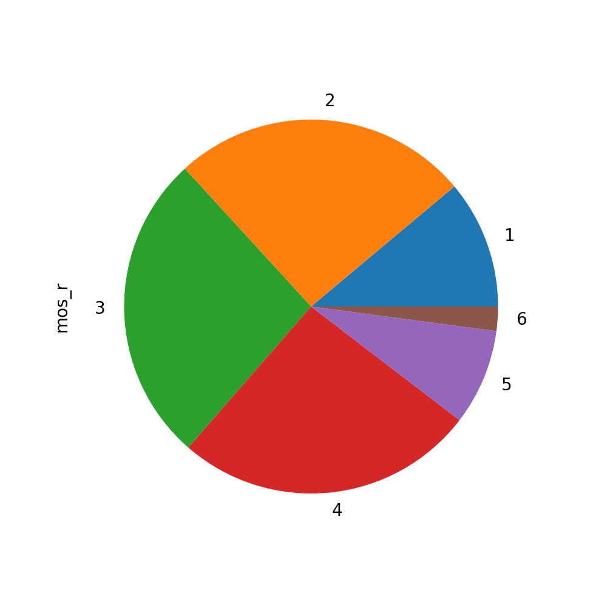
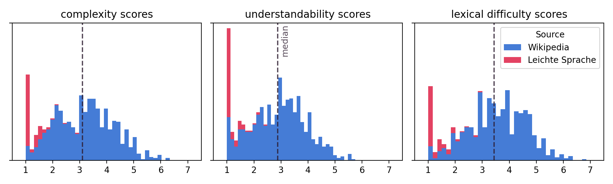
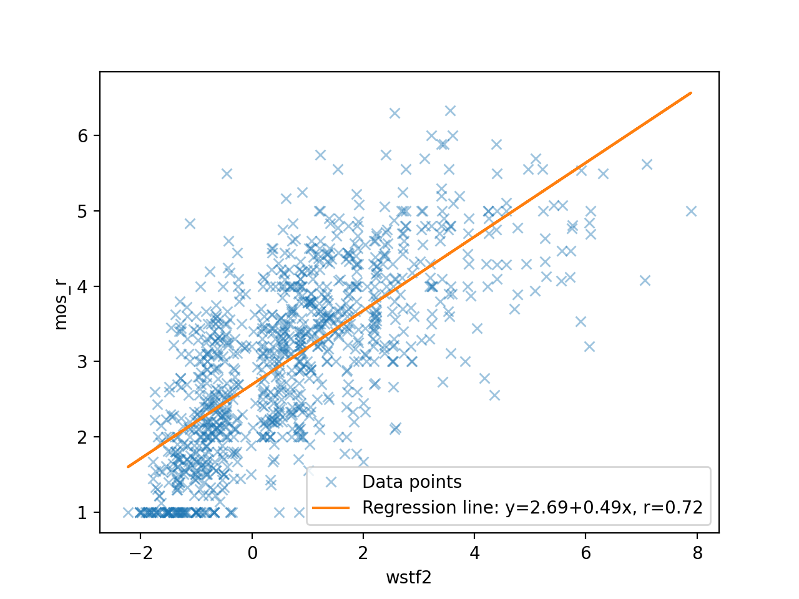
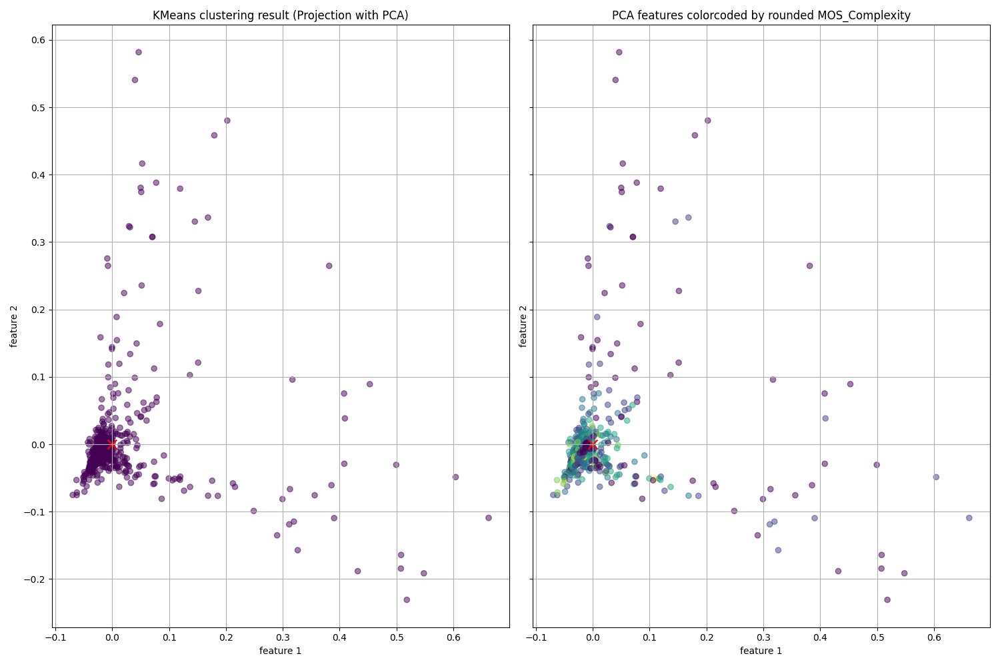

# Automatic Complexity Assessment of German Sentences
### Team Members
Leo Nguyen
Raoul Berger
Konrad Straube
Till Nocher

### Mail Addresses
Leo.Nguyen@gmx.de
raoulb97@gmail.com
konrad.straube@outlook.com
nocher@cl.uni-heidelberg.de


### Existing Code Fragments
### Utilized libraries

## Run code (main entry point will be set later)
Download dataset:
> python download_data.py

## Project State

## Data Analysis

Our primary data source is the TextComplexityDE 19 dataset (https://github.com/babaknaderi/TextComplexityDE), which contains 1000 German sentences, labelled by foreign language learners of levels A and B on a 7 point Likert scale, where 1 indicates a low complexity, high readability sentence and 7 indicates the opposite. 900 of the sentences were sourced from 23 German Wikipedia articles, the other 100 were sourced from Leichte Sprache. Each sentence in the dataset was labelled by at least 5 persons, their mean rating is provided in the dataset. Aside from complexity/readability, scores for understandability and lexical difficulty of the sentence were also collected.



Figure: Pie chart showing the distribution of (rounded) ratings.

The ratings are not evenly distributed, as no sentence received, on average, a 7, and few received a 6. Of the sentences receiving a 1 complexity rating, the vast majority is from the Leichte Sprache data source.



Figure: Stacked bar chart displaying the rating distribution, coloured by source, with median value

We wrote functions for text normalization, to facilitate gathering text statistics. Our text normalization functions transform all letters to lower case, replace hyphens with spaces, remove all punctuation and remove all digits. We then gather statistics, including number of words, number of letters and, with a simple method, number of syllables.

Additionally, we tried a number of different simple metrics which take into account number of words, letters, syllables, polysyllables, monosyllables etc and tested their correlation to the complexity ratings



Figure: Correlation between Automated Readability Index and complexity labels

Interestingly, all of the simple formulas show a weaker correlation to the labels than the very simple metric which is the number of letters in the sentence.

## Clustering Results (to be updated, in progress)

The plot indicates that the features extracted with sklearn TfidfVectorizer are not indicative of the sentence complexity. There is a high change that brute-force Regression might not work well. Note that the preprossing was minimal at this point. However, we should also consider alternative feature spaces/vectorizations for the sentences. 

TODO: Explore further Vectorizer options + improve preprocessing

The homogeneity score shows a value close to zero, which means the cluster found with KMeans are completely different from the rounded MOS Complexity label(k=6, the plot above shows that there are no sentences for the highest difficulty level 7 -> effectively there are only 6 labels). Maybe KMeans clustered by topic other something else (to be further explored). The silhouette score shows that we have strongly overlapping clusters. This further make us sceptical, if the Tfidf feature space is suitable (it doesn't seem too promising).   

homogeneity score: 0.0084
silhouette score: -0.0026



Figure: Comparison Clustering Results against MOS Complexity (rounded to nearest integer)

## Setup

1. [Install](https://pipenv.pypa.io/en/latest/#install-pipenv-today) ```pipenv```. You might want to set ```export PIPENV_VENV_IN_PROJECT=1``` in your ```.bashrc/.zshrc``` for local virtual environments. Thereby you are making sure that all dependencies for your application are stored in the same directory under the `.venv` folder.
<br>

2. Clone repository into preferred directory (or simply download the source code and rename the folder as you like): `git clone https://github.com/jomazi/Python-Default`
<br>

3. Install packages: `cd Python-Default && pipenv install --dev`
<br>

4. Init ```.env``` file. Use this file to store all your environment variables, such as credentials or encryption phrases. This file should never be added to your public repository but should always stay local: `mv .example.env .env`
<br>

5. Activate virtual environment: `pipenv shell`
<br>

6. Test setup: `pipenv run main`
<br>

7. Install Git hooks. They help you to execute tasks before your code is committed (see [Working with Git](#working-with-git)). Learn more about pre-commit in the [official docs](https://pre-commit.com/). ([Installation](https://pre-commit.com/#installation) and [Activation](https://pre-commit.com/#3-install-the-git-hook-scripts) are described here) In our case they are used to make sure that the application code is well formatted using [black](https://github.com/psf/black)/[autopep8](https://github.com/hhatto/autopep8), has no syntax errors using [flake8](https://gitlab.com/pycqa/flake8) and that the dependency imports are well sorted using [isort](https://github.com/PyCQA/isort). The pre-commit instructions are given by the `.pre-commit-config.yaml`. Any isort specific settings are given by the `.isort.cfg` file.

**Note:** To deactivate the environment again, simply run `deactivate`.

## Testing

A script to automatically execute tests is already defined in the project's `Pipfile`. Therefore you can simply run: `pipenv run test`
To generate a report on code coverage alongside run: `pipenv run test && pipenv run report`

## Working with Git

In case you do not know about Git yet it is now time to make yourself familiar with it :)
There are already plenty of very good tutorials about Git out there which is why  we refer to them. For a good introduction written in German you might want to go to [Roger Dudler's awesome post](https://rogerdudler.github.io/git-guide/index.de.html).

### Git Workflow

To coordinate the software development process a set of guidelines are necessary. It is helpful to rely on the [GitHub Flow](https://guides.github.com/introduction/flow/) strategy which defines a branch-based workflow. Essentially, it boils down to the following steps:

1. Create a `main/master` branch. This is done automatically by creating a new project.
2. Create an issue that describes a bug or asks for an additional feature.
3. Add features or solve bug fixes by creating new branches via `git checkout`. Those branches should be named `feature-*` or `fix-*` accordingly. Assign the issue that the code changes are meant to solve.
4. Commit to new feature or fix branch. Make sure that you also write `tests` which cover the new features or show that the bug is solved. They should run automatically using the [GitHub CI system](https://docs.github.com/en/free-pro-team@latest/actions/guides/about-continuous-integration). Having a CI system set up is not mandatory but helps a lot to avoid mistakes during the development process.
5. Create pull request once you are done with your work. Use the @mention system to get the maintainer's attention or ask questions to specific people.
6. Optional discussion about the pull request. If necessary, additional changes can be made.
7. New branch is merged into `main/master` branch.

## Packaging

Packaging a Python application is not as trivial as it seems to be. A good introduction into this topic is given by the official [docs](https://packaging.python.org/overview/). In any case you should always make sure that your program has only one entry point. In this example project it is the `src/main.py` file.

## Important Note

Leave a star ⭐ ;)
